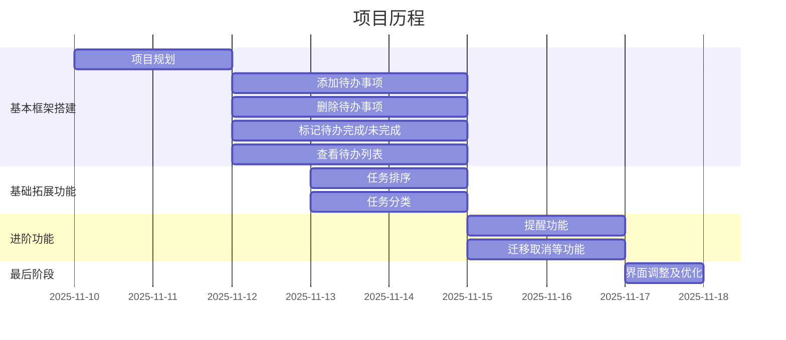

# TODO List 项目说明文档
## 结合todolist与子弹笔记（bujo）核心功能的子弹笔记电子化程序

## 1. 技术选型

- **编程语言**：JavaScript 
理由：开发快速便捷，适用于项目开发初期。
- **框架/库**：React
理由：组件化开发模式便于维护和扩展
- **数据库/存储**：IndexedDB
理由：浏览器内置的数据库，可以存储大量结构化数据

### 替代方案对比
- **localStorage**：
相对于localStorage，IndexedDB提供更大的存储空间和更复杂的查询能力，为项目提供了待办排序功能，且适应未来TODO List应用可能产生的大量任务数据。
- **SQLite（如通过 sql.js）**：
在浏览器环境性能不如 IndexedDB，且项目初期以快速落地为主，后期可随项目迭代更换数据库。

## 2. 项目结构设计
### 整体架构
前端分层架构：
- **视图层（View）**：React 组件，负责 UI 展示和用户交互
- **逻辑层（Logic）**：自定义 Hooks，管理组件状态和业务逻辑
- **数据层（Data）**：API 模块，封装 IndexedDB 操作

```
用户操作 → 组件事件 → Hook 处理 → API 调用 → IndexedDB → 数据返回 → 状态更新 → UI 重渲染
```

### 目录结构

```
src/
  ├── api/
  │   └── todo.js           # IndexedDB 数据操作（增删改查）
  ├── components/
  │   ├── TodoInput.jsx     # 待办输入表单组件
  │   ├── TodoItem.jsx      # 单个待办项组件
  │   ├── TodoList.jsx      # 待办列表容器组件
  │   └── ReminderModal.jsx # 开始/结束提醒与任务迁移操作
  ├── hooks/
  │   └── useTodos.js       # 待办状态管理 Hook
  ├── utils/
  │   └── date.js           # 日期工具函数
  ├── App.jsx               # 主应用组件（组合各子组件）
  ├── main.jsx              # 应用入口（React 根组件挂载）
  └── styles.css            # 全局样式
```

### 模块职责说明

1. **api/todo.js**
   - 负责所有 IndexedDB 交互，包含多版本 schema 迁移（v1→v2 新增 startTime、endTime、status）。
   - 实现 `listToday` / `listTomorrow` / `listAll` 查询，并统一在数据层完成排序（重要程度 → 开始/结束时间 → 创建时间）。
   - 提供状态更新（pending/inProgress/completed/partiallyDone）、时间更新与删除操作。
2. **hooks/useTodos.js**
   - 集中管理视图状态（today/tomorrow/all）、加载态与错误态。
   - 提供统一的增删改查 action，并在每次操作后自动刷新视图。
3. **components/TodoInput.jsx**
   - 负责表单输入、实时校验与提交（含标题/描述/重要性/开始结束时间）。
4. **components/TodoItem.jsx**
   - 展示单条待办的标题、描述、时间与状态标签，支持完成/删除操作。
5. **components/TodoList.jsx**
   - 列表容器，提供“今日/明日/全部”视图切换、空状态与加载状态。
6. **components/ReminderModal.jsx**
   - 依据任务的开始/结束提醒弹窗，引导用户标记进行中、延期、取消、完成或部分完成。
7. **utils/date.js**
   - 日期区间计算及格式化工具。
8. **App.jsx**
   - 组合输入/列表组件，并轮询所有待办（30 秒）触发 ReminderModal，承载任务状态流转逻辑。


## 3. 需求细节与决策

## 技术栈
- React 18.3.1
- Dexie 4.0.7（IndexedDB 封装）
- Vite 5.4.8（构建工具）

### 描述是否必填？如何处理空输入？
- 标题：必填，长度限制 1-120 字符，使用 `trim()` 去除首尾空格
- 描述：可选，最大长度 500 字符
- 表单提交前实时校验，不符合要求时禁用提交按钮
- 输入框下方显示校验提示信息
- 开始/结束时间：可选；若同时填写则必须满足 `startTime <= endTime`

### 任务视图
- 今日视图：展示当日内开始或结束、或跨越当日的任务
- 明日视图：展示次日内的任务
- 全部视图：展示所有任务，维持统一排序规则

### 任务状态与提醒流
- 状态字段：`pending`（默认待开始）、`inProgress`、`partiallyDone`、`completed`
- App 轮询（30s）检测 start/end 时间，触发提醒对话框：
  - start 提醒：可标记“进行中”、填写新开始时间（延期）或取消待办
  - end 提醒：可标记“已完成”或“部分完成 + 调整结束时间”
- 每次操作通过 `useTodos` 提供的 action 写回 Dexie，随后刷新最新数据

### 已完成的任务在 UI 中如何显示？
- 复选框：已完成的复选框变为深色背景并显示勾选图标（SVG）
- 标题：添加删除线样式（`text-decoration: line-through`）和灰色文字

### 任务排序逻辑
1. important 字段（true 在前）
2. deadline 字段（升序，null 排最后）
3. createdAt 字段（升序，作为稳定排序依据）

### 拓展功能设计思路
 基础拓展功能
- 任务分类
	- 用户填写待办时可选择任务重要程度，重要任务将在待办列表置顶显示
- 任务排序
	- 任务排序按天/总任务显示
	- 列表内重要任务置顶，其余任务按时间排序

进阶拓展功能
- 提醒功能+任务迁移功能
	- 任务开始时弹出询问框：任务是否正在进行中
		- 是：添加任务标签（进行中）
		- 否：可选推迟任务至.../取消任务
	- 任务结束时弹出询问框：任务是否完成
		- 是：标记为已完成 
		- 否：标记为部分完成，可选择设定下次完成时间

## 4. AI 使用说明
- 是否使用 AI 工具？使用 AI 的环节：
   - 项目规划期利用kimi快速搜索获得各语言优势劣势，提高效率。
	- 使用cursor实现初稿框架搭建
	- 使用deepseek获得bug解决方法
- AI 输出如何修改：
   - 改使用useState为使用自定义 Hook ，以集中管理状态，提高代码可维护性。
   - AI 的排序实现直接在组件中，修改后将其抽取到 API 层，避免在组件中重复计算
   - 添加了"暂无数据"和"加载中"的状态提示以提升交互体验

## 5. 运行与测试方式

### 本地运行方式
1. **安装依赖**
   ```bash
   npm install
   ```
2. **启动开发服务器**
   ```bash
   npm run dev
   ```
3. **构建生产版本**
   ```bash
   npm run build
   ```
4. **预览生产构建**
   ```bash
   npm run preview
   ```
### 已测试过的环境
- **Node.js**: v20.10.0
- **npm**: v10.2.3
- **浏览器**: Chrome 120+
- **操作系统**: Windows 11

### 已知问题与不足
项目初期只适用于本地，不支持数据同步、数据迁移。
待办不可编辑，不可基于任务类别分类（工作、学习），不可搜索

## 6. 总结与反思 

- 你觉得这个实现的最大亮点是什么？
	> todolist为短期、细碎任务提供了记录、提醒功能，减轻待办记忆压力——尤其是在决策和注意力已经成为稀有资源的当下。
	> bujo相较于todolist更为轻松，作为一种以自我成长为目标的个人管理系统，不以完成所有待办为任务核心，而是通过提供**待办迁移**等功能，帮助用户筛选任务，避免清单堆积。
   - 结合了todolist和bujo的优点，使待办灵活易管理：重要任务置顶 + start/end 时间管理 + remind modal 实现“推迟/迁移”路径，能够有效缓解突发情况导致的任务堆积，缓解用户焦虑，p人友好。
- 如果有更多时间，你会如何改进？
   - 增加任务编辑功能；任务分类可按工作、学习等分类，也可按重要和紧急程度分类
	- 可添加待办月视图，迁移待办时可直接拖拽任务至某天某时，减少了更改时间的繁琐流程
	- 迁移待办时也可直接选择（在原任务基础上）推迟x分钟/小时（推迟时间可用户根据习惯自定义常用值）
